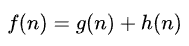

# A-Pathfinding-algorithm

## Background of A* search algorithm
A* is a best-first search algorithm that is informed, meaning it is written in terms of weighted graphs. It starts at a particular starting node in the graph and seeks to find the shortest path to the specified goal node (least distance travelled, shortest time, etc.). It accomplishes this by keeping track of a tree of paths leading from the start node and extending each of those paths by one edge until its termination requirement is met.
A* must choose which of its paths to extend for each iteration of its main loop. Based on the path's cost and an estimate of how much it would cost to continue the path all the way to the target, it makes this decision. Specifically, A* selects the path that minimizes the  

## Formula

If n is the following node on the path, g(n) represents the cost of the route from the start node to n, and h(n) is a heuristic function that calculates the price of the shortest route from n to the target. A* comes to an end if there are no paths that can be extended or if the path it chooses to extend leads from start to goal. The heuristic function is situational. A* is guaranteed to deliver a least-cost path from start to objective if the heuristic function is acceptable, which means that it never underestimates the real cost to reach the goal.
Euclidean distance is used for this model to navigate to any of the grids even with diagonally movement  

# Example :

